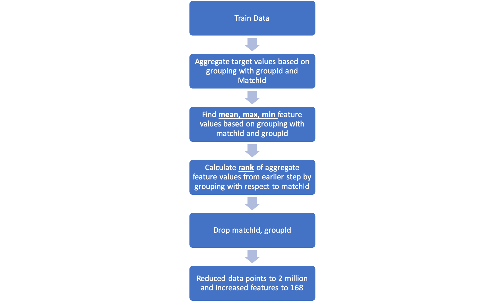
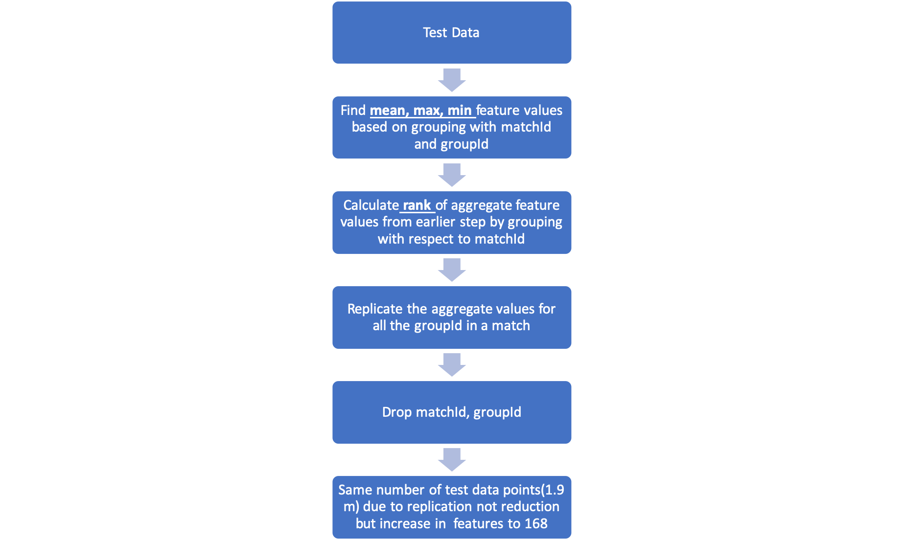
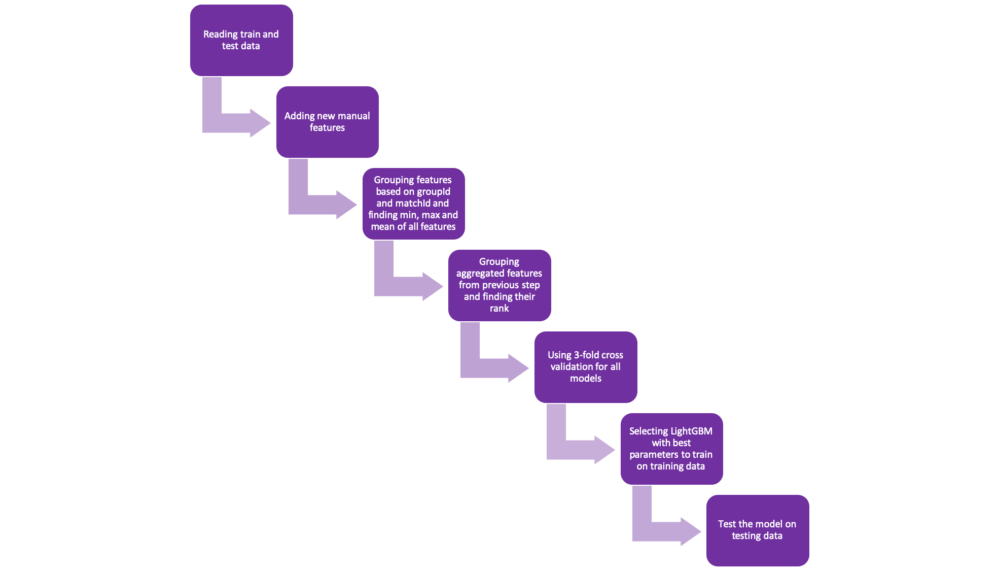

# Kaggle-Project-PUBG-Finish-Placement-Prediction

- This project is taken up from Kaggle, an online community of data scientists and machine learners ([link to competition](https://www.kaggle.com/c/pubg-finish-placement-prediction))
- The goal of the project is to predict PUBG player’s win place percentage based on the player’s statistics.
- Millions of players data is used for building a regression model. The training dataset provided has a size of 4 million and testing dataset has a size of 1 million.
- Players data within a group in a match is combined to reduce the dataset size.
- Some insightful derived features are added to improve the predictions.
- The best model using Light Gradient Method achieved a Kaggle leaderboard score of 0.0245 on test data.
- I carried out a lot of experiments which has been mentioned in [Report.pdf](https://github.com/deepikakanade/Kaggle-Project-PUBG-Finish-Placement-Prediction/blob/master/Report.pdf) file. 

The training and testing data have been handled seperately in the following way:

The flow chart for final algorithm has been mentioned below:

